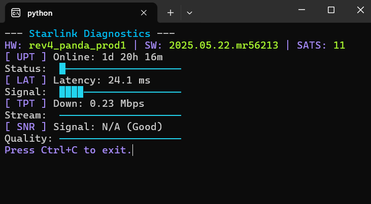

# Starlink Terminal Dashboard

A Python script to monitor Starlink dish diagnostics in real-time, displaying uptime, latency, throughput, and SNR in a colorful ASCII-based terminal interface.



## Features  
- **Real-Time Metrics**:
  - Uptime (days/hours/minutes)
  - Latency (ms)
  - Downlink (Mbps)
  - Sign-to-Noise Ratio (SNR, with Good/Weak indicator)
  - Hardware/Software versions and GPD Satellite count (SATS)
- **Configurable**:
  - **Ping-Drop Mode**: Shows optional outage metrics when using the `--mode ping_drop` flag
  - **Debug Mode**: Logs raw data to `logs/errors.txt.`  

## Requirements
- Python 3.6+
- [colorama](https://pypi.org/project/colorama/) for ANSI color support
- Starlink gRPC tools (`dish_grpc_text.py`) in a `starlink-grpc-tools` subdirectory  
    *already included, latest version found here:  
    ```
    git clone https://github.com/sparky8512/starlink-grpc-tools
    ```
- Windows (tested in PowerShell) or Unix-ish OS

## Setup
1. **Clone or Save this Repo**:
   - Open the project in your IDE.

2. **Install Dependencies**:
    ```powershell
    python -m venv venv
    .\venv\Scripts\Activate.ps1
    pip install colorama
    ```

3. **Test Starlink gRPC Tools**:
    ```powershell
    cd starlink-grpc-tools
    python dish_grpc_text.py -v status
    ```

## Usage
Run the script from the project directory.
```powershell
python starlink_monitor.py
```

## Command-Line Options
- `--mode {status, ping_drop}`: Data mode (default: `status`).
  - `status`: General metrics (uptime, latency, throughput, SNR).
  - `ping_drop`: Includes ping drop rates.
- `--debug`: Logs raw data to `logs/errors.txt`.

## Reading the Diagnostic Output
The dashboard updates every second, displaying:

- Version Line: Starlink dish hardware and software versions, including the number of visible satellites.
- Uptime (UPT): Time since last reboot. Bar shows uptime (scaled to 30 days; 1 block ≈ 1.5 days).
- Latency (LAT): Ping time. Bar shows latency (scaled to 100ms; 1 block ≈ 5 ms).
- Throughput (TPT): Downlink speed. Bar shows throughput (scaled to 200Mbps; 1 block ≈ 10 Mbps).
- Signal-to-Noise Ratio (SNR): Indicates signal strength; `good` or `weak` (N/A if unavailable).

## Contributing
- Go for it! Add features (outage tracking? obstruction map?).
- Report issues or suggest tweaks.

# Author & License
R. Brandon Thompson  
MIT License